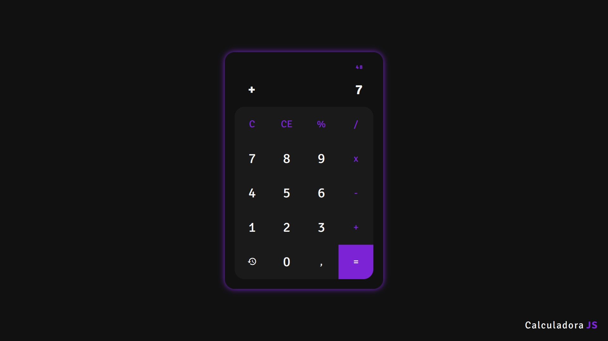
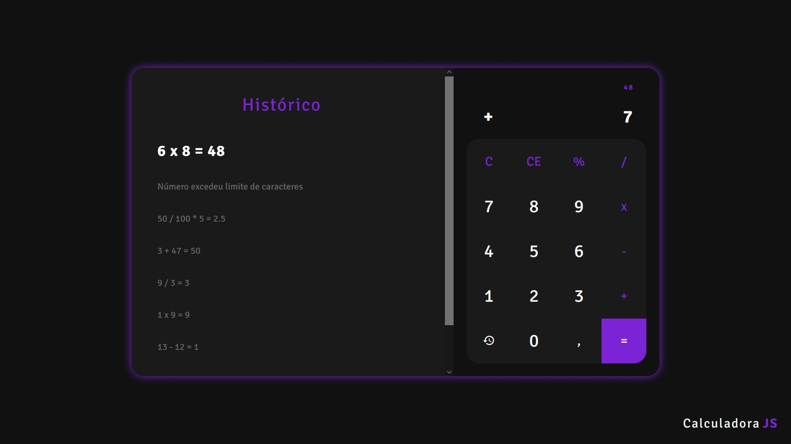
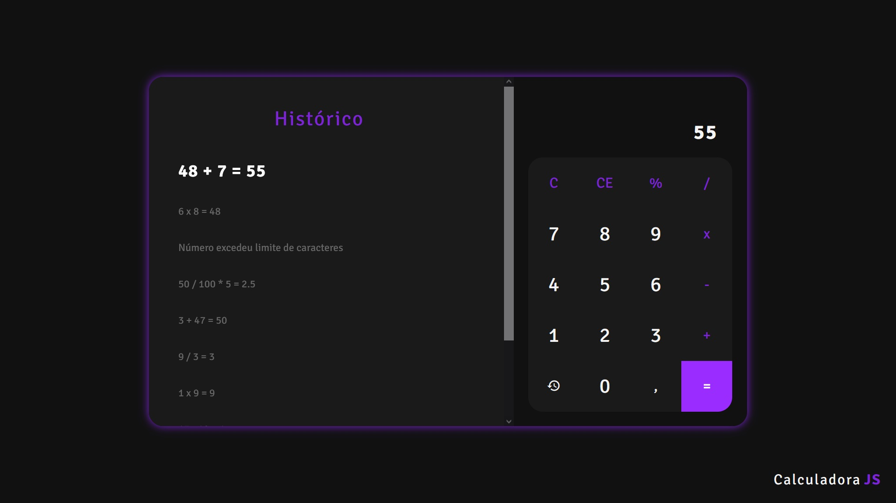

<h1>CalculadoraJS</h1>
  <h2>Sumário</h2>
    <ul>
      <li><a href="#sobre">Sobre</a></li>
      <li><a href="#tecnologias">Técnologias utilizadas</a></li>
      <li><a href="#instalacao">Rodando a aplicação</a></li>
      <li><a href="#galeria">Galeria</a></li>
      <li><a href="#nota">Notas</a></li>
    </ul>    
  <h2 id='sobre'>💬 Sobre</h2>
  Este projeto é um teste pessoal que realizei para por em prática minha Lógica de Programação.
  
  <h2 id='tecnologias'>👨‍💻 Técnologias utilizadas</h2>
    HTML, CSS e JavaScript
    
  <h2 id='instalacao'>🚀 Rodando a Aplicação</h2>  
  
Para executar a aplicação basta rodar o arquivo "index.html" em seu navegador.

  <h2 id='galeria'>🖼 Galeria</h2>
  
Calculadora - Histórico fechado

  
  
Calculadora - Histórico aberto (cálculo não realizado)

  
  
Calculadora - Histórico aberto (cálculo realizado)

  
  
  <h2 id='nota'>📃 Notas</h2>
  
Projeto feito exclusivamente para estudos, ou seja, sem visar nenhuma forma de lucro.

  
Projeto realizado com a ajuda de Robert da Silva Gomes (GitHub: <a href="https://github.com/RobertSGomes/">RobertSGomes</a>).

  
